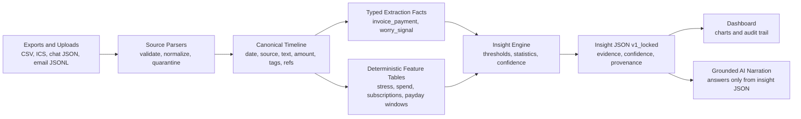
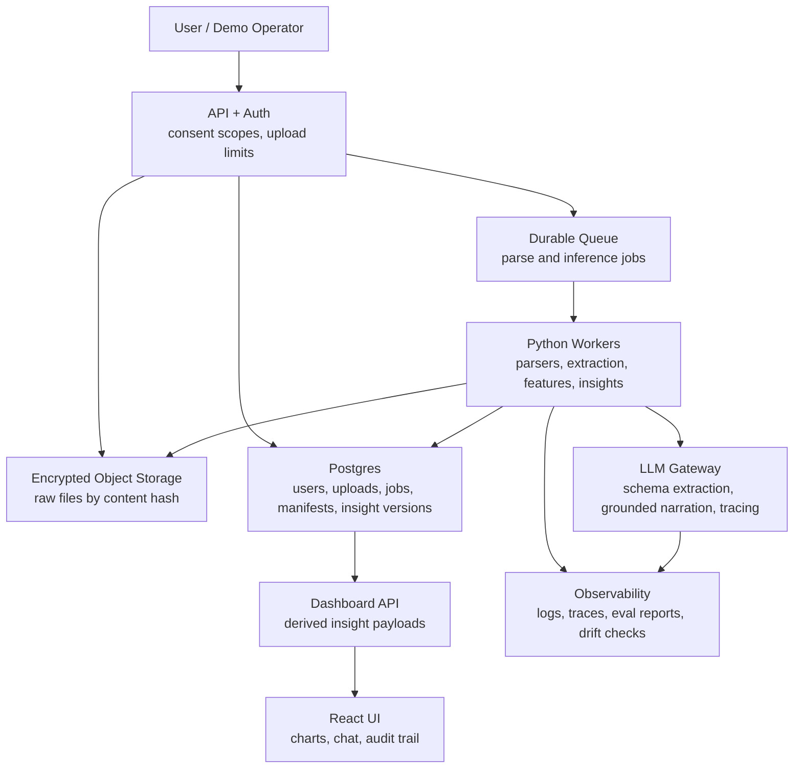

# Production Architecture Notes

LifeLedger is intentionally file-backed for the portfolio demo, but the architecture maps cleanly to a production ingestion system.

## High-Level Flow

The core principle is: compute before narrating. The model is not the source of truth for financial conclusions. It can extract structured facts and explain computed insights, but the durable decision layer is deterministic and testable.

## Demo Mode

The committed demo path uses:

- `data/sample/` for synthetic raw fixtures.
- `outputs/insights_*.json` for frozen dashboard payloads.
- session-only upload processing through the local Express/Python bridge.
- no database, migrations, hosted secrets, or background job system.

This is deliberate. It makes the project easy to clone, run, inspect, and discuss without asking the interviewer to provision infrastructure.

## Production Mode

In production, the same modules would sit behind these services:

| Layer | Production Choice | Why |
|---|---|---|
| API/Auth | API service with user auth and consent scopes | Separates identity, upload authorization, and analysis requests |
| Raw file storage | Encrypted object storage | Stores original CSV/ICS/export files outside the database |
| Metadata DB | Postgres | Tracks users, uploads, jobs, source manifests, consent, retention, and insight versions |
| Queue | Durable queue such as SQS, Cloudflare Queues, or BullMQ | Handles parsing and feature computation asynchronously |
| Workers | Python workers | Run parsers, extraction, feature engineering, and insight generation |
| Derived store | Postgres JSONB or warehouse tables | Stores canonical rows, typed facts, feature snapshots, and insight payloads |
| LLM gateway | Provider router with per-request tracing | Supports BYOK or managed keys, fallback, rate limits, and cost controls |
| Observability | Structured logs, traces, job metrics, eval reports | Makes extraction failures and insight drift visible |

## Database Role

A database is not necessary for the local demo because the sample data is static and the upload path is session-only.

A database becomes necessary when the system needs:

- user accounts and consent records
- upload status and retryable jobs
- retention and deletion workflows
- insight history and version comparison
- audit trails from insight back to source files
- multi-device dashboard persistence
- team/admin operations

Raw source files should usually remain in object storage, while the DB stores manifests, normalized row references, extraction facts, derived metrics, and insight JSON.

## Ingestion Pipeline

1. Receive files and record upload metadata.
2. Store raw files encrypted with a content hash and manifest row.
3. Parse each source into normalized rows:
   - bank CSV -> transaction rows
   - calendar ICS -> event rows
   - ChatGPT/Claude export -> conversation rows
   - email export -> email rows
4. Validate row contracts and quarantine malformed records.
5. Extract typed facts:
   - `invoice_payment` facts with amounts, hours, source IDs, evidence spans, and confidence
   - `worry_signal` facts with themes, source IDs, evidence spans, and confidence
6. Compute deterministic features:
   - calendar stress scores
   - discretionary spend tags
   - weekly stress/spend correlations
   - recurring subscription candidates
   - payday windows
   - savings velocity
7. Build insight JSON with confidence and provenance.
8. Serve insight JSON to the dashboard and grounded AI chat.

## AI Extraction Boundary

AI belongs in two places:

- Structured extraction when regex/parsers are insufficient, with schemas, confidence, evidence spans, and human-readable failure modes.
- Grounded explanation over precomputed insight JSON.

AI should not silently decide that someone is undercharging, overspending, or financially unhealthy. Those conclusions should come from explicit business rules, statistical features, and thresholds that can be tested.

## Insight Examples

| Insight | Deterministic Inputs | AI Role |
|---|---|---|
| Stress-spend correlation | Calendar stress scores plus weekly discretionary spend | Explain the computed pattern |
| Worry timeline | Conversation worry facts plus weekly spend | Extract or classify worry themes, then explain |
| Invoice rate risk | Invoice facts plus calendar hours and rate baseline | Extract invoice facts; deterministic math flags risk |
| Subscription creep | Recurring bank charges plus subscription hints | None required for current demo |
| Post-payday surge | Income deposits plus spend windows | None required |

## Production Hardening Checklist

- Idempotent ingestion keyed by file hash and parser version.
- Schema versioning for canonical rows and insights.
- Golden fixture tests for expected insights.
- Confidence/provenance fields on every insight.
- UI-visible audit trail for source types, methods, record counts, and evidence refs.
- Deletion jobs tied to consent and retention settings.
- PII redaction in logs and model prompts.
- Model outputs constrained by JSON schemas.
- Canary datasets to detect extraction drift.
- Replayable jobs for parser and feature upgrades.
- Cost and latency budgets per upload.

## Interview Framing

The strongest concise framing:

> LifeLedger is a personal-data ingestion and inference system. It turns messy exported files into a canonical timeline, extracts typed facts with provenance, computes deterministic behavioral insights, and uses grounded AI only to explain what the system can prove.
