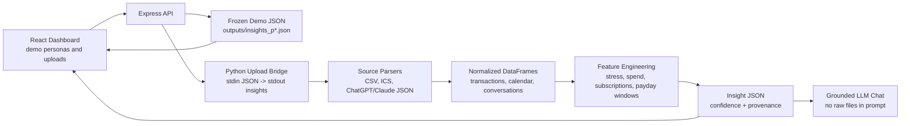
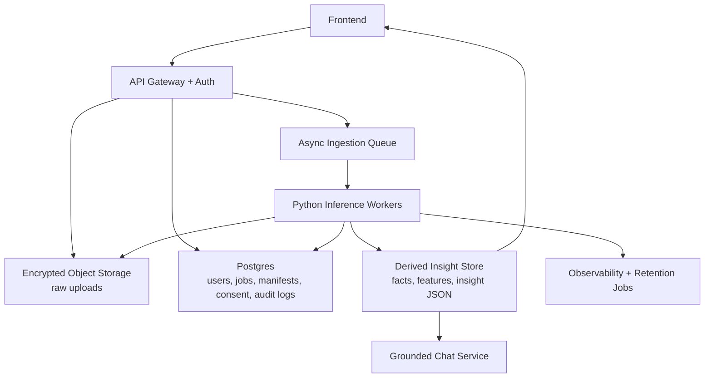

# System Design Notes

## One-Sentence Architecture

LifeLedger is a multi-source ingestion and inference system: it takes fragmented personal exports, normalizes them into a canonical timeline, computes deterministic behavioral signals, and uses a grounded AI layer to explain the resulting insights.

## Current Demo Architecture



The demo intentionally avoids a database. That keeps local setup simple, protects user-uploaded files by not persisting them, and makes the demo deterministic. The tradeoff is that user upload history, job retries, and multi-user workflows are out of scope for the local prototype.

## Data Model Choices

- Raw sources stay source-specific: bank CSV, calendar ICS, AI chat JSON, email/persona JSONL.
- The loader normalizes every source into a shared timeline contract: `ts`, `date`, `year_week`, `source`, `text`, `amount`, `tags`, `refs`.
- Feature modules operate on normalized dataframes, not raw files.
- The dashboard and chat consume derived insight JSON, not raw personal records.

This separation is the most important design decision. It lets new data sources be added at the parser layer without rewriting the feature and UI layers.

## Inference Choices

The system does deterministic inference before LLM generation:

- calendar density and deadline keywords -> stress scores
- transaction text and tags -> discretionary spend categories
- stress/spend overlap -> spike weeks and correlation evidence
- conversation text -> typed `worry_signal` facts -> worry timeline and anxiety themes
- invoice emails -> typed `invoice_payment` facts -> invoice/calendar rate math -> undercharging risk

The LLM is deliberately downstream. It only receives precomputed insight JSON, so the AI layer explains grounded findings instead of inventing calculations.

## Hosting Recommendation

A hosted sample-data deployment is useful, but it should not accept sensitive real uploads unless auth, storage policy, and deletion controls are in place.

Sample-data deployment:

```text
Vercel/Cloudflare Pages frontend
  -> small API service
    -> sample output JSON
    -> optional upload endpoint with strict size limits
    -> Python worker or serverless function for parsing/inference
    -> BYOK or server-side model key for chat
```

Production version:



## Key Architecture Tradeoffs

### File-backed demo vs database

File-backed JSON is ideal for a deterministic local prototype. Production needs Postgres for users, jobs, consent, audit history, and insight versions.

### Sync upload path vs async jobs

The current upload path is synchronous because sample files are small. Production should enqueue ingestion jobs so large exports, retries, and partial failures do not block the web request.

### Raw data retention vs privacy

The demo does not persist user uploads. Production should let users choose retention policy, encrypt raw uploads, and keep derived insight payloads separately from source files.

### Deterministic features vs LLM-first analysis

Deterministic feature engineering gives testable, inspectable evidence. The LLM is used for narration and Q&A only after the evidence is computed.

### Canonical timeline vs source-specific analysis

The canonical timeline makes cross-source patterns possible. Source-specific parsers remain isolated so adding a new export type does not destabilize the whole system.

## System Walkthrough

1. Start with the product problem: financial behavior is hidden across bank, calendar, chat, and email exports.
2. Show the sample persona dashboard and one strongest insight.
3. Open the raw sample files in `data/sample/` to show the ingestion inputs.
4. Trace one path: `sample_transactions.csv` or `persona_p05/emails.jsonl` -> parser/loader -> insight engine -> dashboard.
5. Open the Insight Audit Trail panel and show confidence, method, source counts, and evidence refs.
6. Explain why the LLM is downstream of deterministic evidence.
7. Close with the production architecture: object storage, Postgres, queue, workers, derived insight store, grounded chat.

Use [`context/PRODUCTION_ARCHITECTURE.md`](PRODUCTION_ARCHITECTURE.md) for the longer production-grade architecture notes.
Use [`context/EVALUATION_AND_QUALITY.md`](EVALUATION_AND_QUALITY.md) for the evaluation and regression-testing story.

## Generalization Pattern

The same architecture applies to other messy operational data domains:

```text
fragmented exports
  -> ingestion
  -> canonical schema
  -> deterministic feature extraction
  -> inference/recommendations
  -> workflow UI
  -> grounded AI explanation
```

For an operations system, the sources might be ERP, CRM, supplier portals, pricing files, inventory, and email RFQs. For LifeLedger, they are bank CSVs, calendars, chat exports, and emails. The engineering problem is similar: normalize messy operational data, compute useful signals, and present the result in a workflow people can act on.
